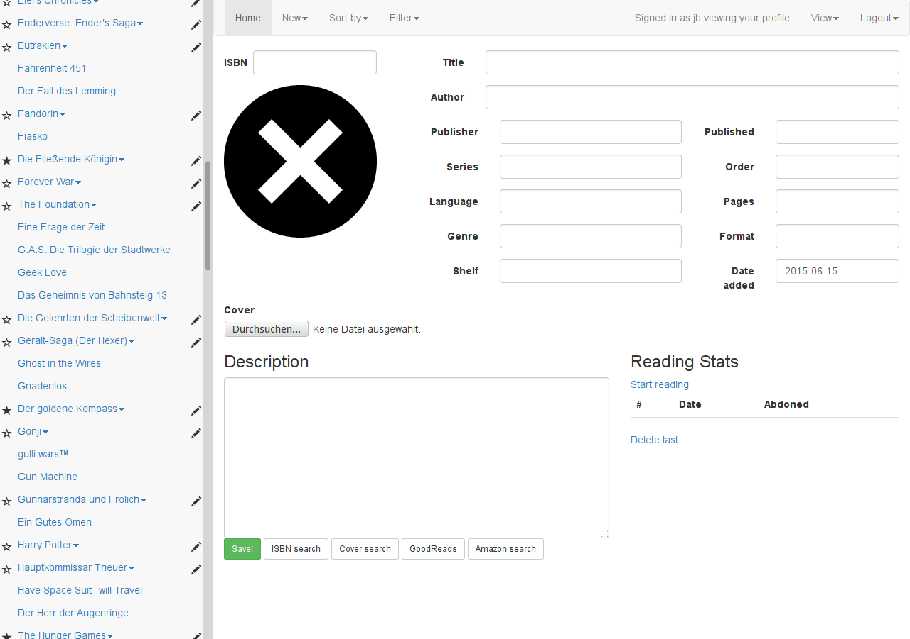
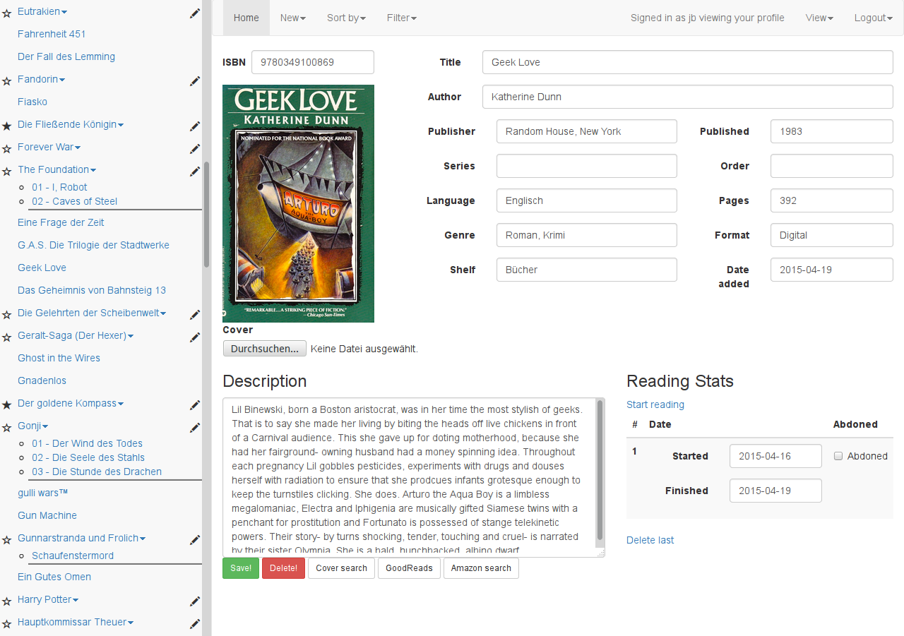
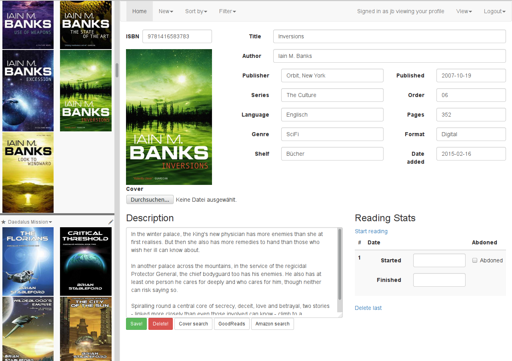
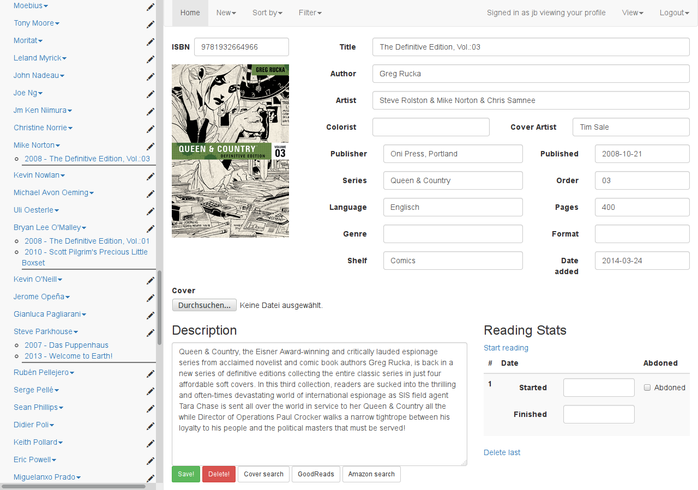
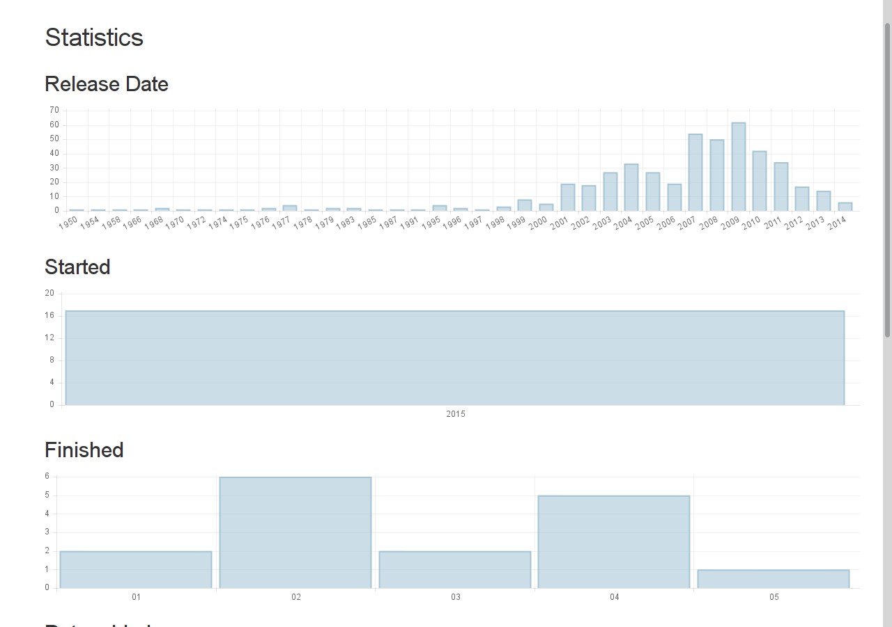

# Bibthek
## What is Bibthek?
Bibthek is a webapp to organize your book/comic/audiobook collection.
Sort and filter your books by different options.
Track what you are reading and what you have already read.

Inspired by gcstar.

## Usage
### Before the first start:
Copy "app.conf.example" to "app.conf"
### Start the app

```
$ cd WORKING_DIR
$ python bibthek.py
```

## Dependencies
* python3
* python3-cherrypy
* python3-passlib
* python3-pillow

## Screenshots
### Add a new book

### Sort by series in books view mode

### Sort by series in cover view mode

### Sort by artist in books view mode


Of course more sorting options are avaible.
### Statistics 
Tipp: click on a year to get more detailed statistics for that year.



##JS, CSS, Fonts, Icons distributed with this release
* [Bootstrap](http://getbootstrap.com/)
* [GLYPHICONS](http://glyphicons.com/)
* [jQuery](https://jquery.com/)
* [OpenIconic](https://useiconic.com/open)
* [Chart.js](http://www.chartjs.org/)
* [Jasny Bootstrap](http://jasny.github.io/bootstrap/)
* [jQuery-Autocomplete](https://github.com/devbridge/jQuery-Autocomplete)
* [jQuery-Storage-API](https://github.com/julien-maurel/jQuery-Storage-API)
